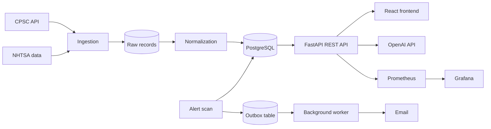

# RecallGraph

[](https://github.com/lavanesh-tech/recallgraph/actions/workflows/ci.yml)

RecallGraph is a full-stack web application for searching and tracking U.S. product recalls. It pulls official data from the CPSC and NHTSA, cleans it into one PostgreSQL schema, and lets a user search recalls, check whether a product they own matches one, save products to get email alerts, and read an AI-generated summary of a recall that cites the official record.

I built it to practice backend engineering end to end: data ingestion, REST API design, search, authentication, background jobs, testing, containers and monitoring.

Stack: Python, FastAPI, PostgreSQL, SQLAlchemy, React, Docker, GitHub Actions, OpenAI API.

## What it does

- Search 40,348 official recalls by keyword, manufacturer, model, source and date.
- Match a product (description, brand, model number or UPC) to recalls and show the reasons for each match.
- Save products to a personal inventory and get alerts when a new recall matches one of them.
- Generate a plain-English summary of a recall with the OpenAI API, where each point links back to the fact in the official record it came from.

A search with no results is never shown as "safe". The app only covers the data it has loaded, and says so.

## Results

These numbers come from real runs. Each one has a JSON file in [`evidence/`](evidence) with the date, commit, environment and command used.

- Loaded and normalized 40,348 recalls (10,027 CPSC and 30,321 NHTSA) with 0 rejected records.
- Built a 400-case labeled test set for product matching. Tuning the matching engine raised F1 on the held-out split from 0.368 to 0.780 (precision 0.226 to 0.646, recall 0.986, top-1 accuracy 0.888 to 0.930) with 0 false positives on negative cases.
- Matching by model number or UPC scored 1.0 precision and 1.0 recall.
- Tested AI summaries against 20 real recalls with gpt-4o-mini: all 20 were fully cited, and all 20 off-topic questions were correctly declined.
- Tried adding vector search (pgvector embeddings). It did not meet the improvement target I set before running it (F1 changed by -0.0018), so I left it out of the product.
- 198 backend tests at 85% line coverage, 10 frontend unit tests at 88.75% line coverage, and 4 browser end-to-end tests with Playwright.
- On a single API process on a laptop: search responds in 15.8 ms median (19.1 ms p95). At 32 concurrent users, search handles 348 requests/second and recall lookups 367 requests/second. Product matching handles 51 requests/second and is the current bottleneck.

## Architecture



How the main parts work:

- **Ingestion.** Downloads recall data from both agencies with retries, stores each raw record once (deduplicated by a SHA-256 content hash), and keeps a link from every cleaned record back to its source.
- **Search.** PostgreSQL full-text search with weighted fields plus trigram similarity for partial model numbers, with filters and pagination.
- **Matching.** A rule-based scoring engine that combines identifier, manufacturer, category, text and date signals. Every match returns its score and the evidence for each signal, so results can be explained and tested.
- **AI summaries.** The recall is looked up from the database first. The model only receives numbered facts from that record and must cite them. A validation step rejects any answer with missing or invalid citations or any claim that a product is safe, and falls back to a template built from the same facts. The model never handles authentication, user data or database queries.
- **Alerts.** A scheduled job compares saved products with new recalls. Alerts are written to an outbox table in the same database transaction, and a background worker sends the emails with retries, a dead-letter queue and replay. I measured about 4 new recalls per day, so I chose this pattern over Kafka.
- **Authentication.** Argon2id password hashing, short-lived JWT access tokens, and rotating refresh tokens that revoke the whole session if one is reused.

Design decisions and trade-offs are written up in [`docs/DECISIONS.md`](docs/DECISIONS.md).

## Tech stack

- Backend: Python 3.12, FastAPI, SQLAlchemy 2 (async), asyncpg, Alembic, Pydantic, structlog
- Database: PostgreSQL 17 (full-text search, pg_trgm, pgvector)
- Frontend: React, Vite, React Router, JavaScript, HTML, CSS
- AI: OpenAI API with structured JSON output
- Testing: pytest, Vitest, React Testing Library, Playwright
- DevOps: Docker, Docker Compose, GitHub Actions CI, Prometheus, Grafana
- Code quality and security: ruff, mypy, ESLint, gitleaks, pip-audit, npm audit, Trivy

## Security

- Users can only see their own saved products and alerts; requests for anyone else's data return 404.
- Rate limiting on login and sign-up, request size limits and strict input validation.
- Security headers (Content Security Policy, HSTS in production), CORS closed by default, API docs turned off in production.
- The frontend keeps the access token in memory, not in localStorage.
- CI checks every push for leaked secrets, vulnerable Python and npm packages, and critical vulnerabilities in the Docker image.

Details and known limitations: [`docs/SECURITY.md`](docs/SECURITY.md).

## Running it locally

You need Docker, [uv](https://docs.astral.sh/uv/), Node 22 and make.

```bash
git clone https://github.com/lavanesh-tech/recallgraph.git
cd recallgraph
cp backend/.env.example backend/.env    # add an OpenAI key here if you have one
make install db-up migrate
make ingest-cpsc normalize-cpsc
make ingest-nhtsa normalize-nhtsa
make run                                # API at http://127.0.0.1:8001
make web-install web-dev                # frontend at http://127.0.0.1:5173 (second terminal)
```

Without an OpenAI key, recall summaries are built from a template instead.

To run everything in Docker (API, worker, database, frontend, email inbox, Prometheus and Grafana):

```bash
RECALLGRAPH_JWT_SECRET=$(openssl rand -hex 32) make stack-up
# app: 127.0.0.1:8080  Grafana: 127.0.0.1:3000  email inbox: 127.0.0.1:8027
make stack-down
```

## Tests

```bash
make check       # lint, type check, migration check, backend tests
make coverage    # coverage for backend and frontend
make e2e         # Playwright tests against the running app
make bench       # latency benchmark
```

Automated tests never call the paid OpenAI API; they use a fake client. The real evaluation only runs when started by hand: `uv run recallgraph explain eval --sample 20`.

## API

| Method | Endpoint | Description |
|---|---|---|
| GET | `/api/v1/recalls` | Search recalls |
| GET | `/api/v1/recalls/{id}` | Recall details and source |
| POST | `/api/v1/match` | Match a product to recalls |
| POST | `/api/v1/recalls/{id}/explanation` | AI summary with citations (login required) |
| POST | `/api/v1/auth/register`, `/login`, `/refresh` | Accounts and tokens |
| GET, POST, PATCH, DELETE | `/api/v1/inventory` | Saved products (login required) |
| GET, POST | `/api/v1/radar/alerts` | Recall alerts (login required) |

Errors use the RFC 9457 problem details format and include a request ID for tracing.

## Project structure

```
backend/      API, ingestion, matching, alerts, worker, tests
frontend/     React app, unit tests, Playwright tests
evaluation/   labeled matching dataset and method
evidence/     measured results behind every number in this README
docs/         design decisions, security, monitoring, benchmarks
ops/          Prometheus alert rules and Grafana dashboard
```

## Next steps

- Deploy to AWS (ECS Fargate, RDS PostgreSQL, load balancer) with Terraform.
- Continuous deployment from GitHub Actions.
- Speed up product matching, which is the slowest endpoint today.

## Data sources

Recall data is public data from the [U.S. Consumer Product Safety Commission](https://www.saferproducts.gov/) and the [National Highway Traffic Safety Administration](https://data.transportation.gov/). This is a personal project and is not affiliated with either agency. Always check the official recall notice.

## Contact

Lavanesh, [github.com/lavanesh-tech](https://github.com/lavanesh-tech)
